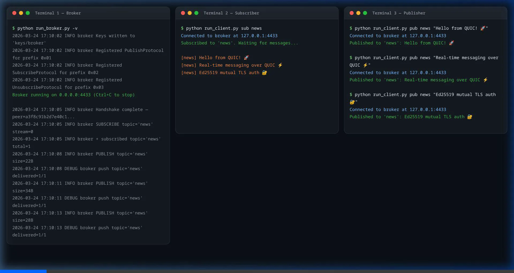
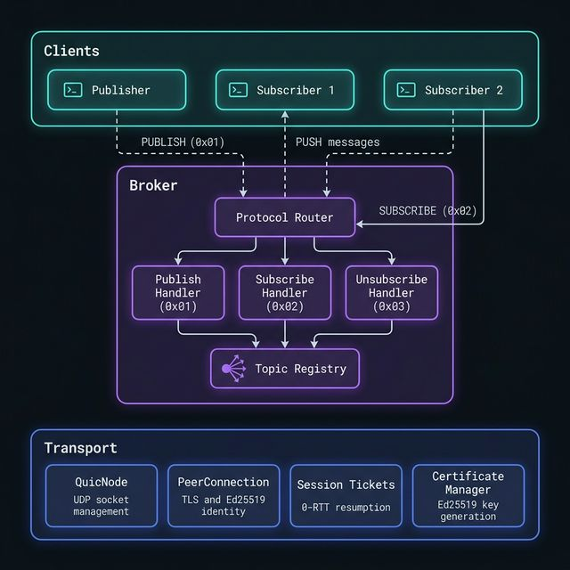

# QUIC-PubSub (Quiver)

A lightweight, real-time distributed pub/sub message broker built purely on [QUIC](https://en.wikipedia.org/wiki/QUIC) using Python 3.13 and `aioquic`.

This broker eschews TCP for QUIC to achieve secure, low-latency messaging. Every peer connection is automatically authenticated via mutually-exchanged Ed25519 certificates, ensuring zero-trust security without passwords.

## Demo



## Architecture



This project consists of three main layers:

1. **Transport Layer (`transport/`)** - A custom `QuicNode` that wraps `aioquic`. It handles UDP sockets, QUIC connection lifecycle, 0-RTT session resumption tickets, and fully automated TLS verification using Ed25519 identity keys encoded as certificate SANs.
2. **Broker Layer (`broker/`)** - The server side that accepts connections and implements the pub/sub protocol. A `ProtocolRouter` decodes the first 1-byte prefix of any incoming QUIC stream to route it (e.g. `0x01` for Publish, `0x02` for Subscribe) to the `TopicRegistry`, which tracks active subscribers and handles message fan-out over persistent push streams.
3. **Client (`run_client.py`)** - A CLI client implementing the wire protocol for publishing strings or subscribing to live updating topics.

## Quick Start

### 1. Requirements

- Python 3.13+
- Installed virtual environment

### 2. Setup

Activate the environment and install the development dependencies:

```bash
python3 -m venv .venv
source .venv/bin/activate
pip install -e ".[dev]"
```

### 3. Run the Broker

Starting the broker automatically generates the Ed25519 identity keys (stored in `keys/broker`) and binds to UDP:

```bash
python run_broker.py -v
```

By default it listens on `0.0.0.0:4433`.

### 4. Run a Client Terminal

In a separate terminal, subscribe to a topic. The client acts as a long-lived subscriber, receiving QUIC stream pushes without closing the connection.

```bash
source .venv/bin/activate
python run_client.py sub system-alerts
```

In a third terminal, publish a message. The publisher sends the message using a request-response flow, receives an ACK from the broker, and disconnects.

```bash
source .venv/bin/activate
python run_client.py pub system-alerts "Deploy completed successfully"
```

## Protocol Specifications

The system uses a custom wire format, routing entirely on the first byte of a stream.

| Action          | Prefix Byte | Wire Format (Client → Broker)                        | Wire Format (Broker → Client)            |
| --------------- | ----------- | ---------------------------------------------------- | ---------------------------------------- |
| **Publish**     | `0x01`      | `[0x01][4B topic_len][topic][4B msg_len][msg] + FIN` | `[0x00] + FIN` (ACK)                     |
| **Subscribe**   | `0x02`      | `[0x02][4B topic_len][topic] + FIN`                  | `<Persistent Stream>`                    |
| _Push Data_     |             | _(Broker to Subscriber on active sub stream)_        | `[4B msg_len][msg]` (Repeated as needed) |
| **Unsubscribe** | `0x03`      | `[0x03][4B topic_len][topic] + FIN`                  | `[0x00] + FIN`                           |

## License

MIT
